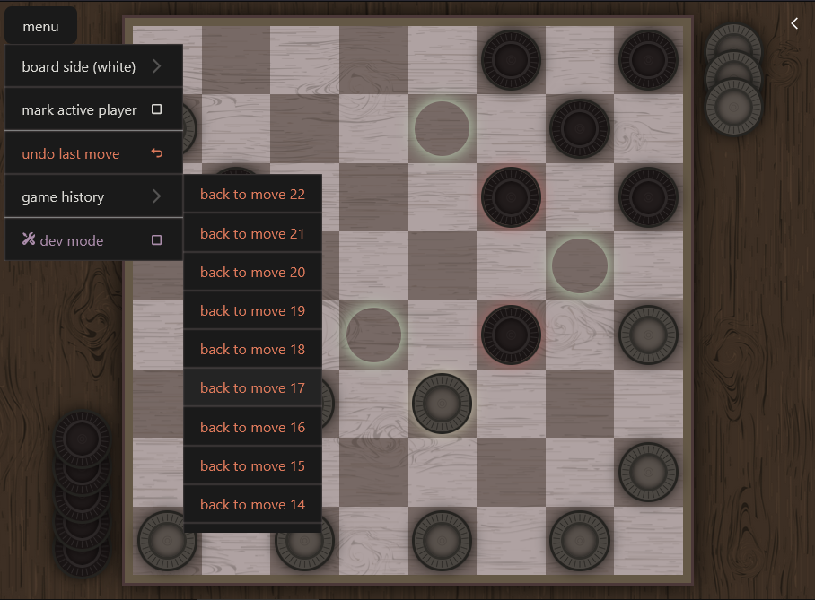

# American Checkers

This is just simple checkers game (American rules), with no opponent logic implemented (two real players only), created in order to learn React.js

[> Play](https://crydy.github.io/checkers-css/)

